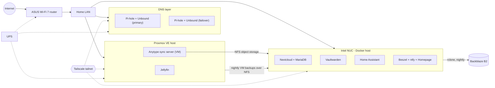

# Casa Bermudez Home Lab

A self-hosted infrastructure lab I designed, built and run at home. It hosts my family's file sync, password manager, notes, smart-home control and media, and it is built the way I would want production systems to be built: automated backups with integrity checks, monitoring with push alerts, no ports open to the internet, pinned versions, and a written record of every change and failure.

---

## At a glance

- **Hypervisor:** Proxmox VE on a mini PC, running Linux VMs and Docker workloads
- **Container host:** Intel NUC running Docker Compose on an immutable Fedora Atomic OS (SELinux enforcing)
- **DNS:** Two Raspberry Pi nodes running Pi-hole with Unbound as a recursive resolver, primary and failover
- **Remote access:** Tailscale mesh VPN with subnet routing and an exit node; zero inbound ports on the router
- **Backups:** Nightly systemd-timed jobs to Backblaze B2 plus a local copy on a separate host (3-2-1)
- **Monitoring:** Beszel agents on every host, with ntfy push alerts for host outages, disk thresholds and failed jobs
- **Power:** Everything critical sits behind a line-interactive UPS, verified with a live mains-pull test

---

## Architecture

---

## Hardware

| Device | Role |
|---|---|
| GMKtec G3 Pro (Intel i3-10110U) | Proxmox VE hypervisor |
| Intel NUC 10 (i5-10210U, 8 GB) | Docker host, NFS server, backup orchestrator, Tailscale exit node |
| Raspberry Pi 4 + Raspberry Pi | Pi-hole + Unbound DNS, primary and failover; Tailscale subnet router |
| ASUS RT-BE58U | Wi-Fi 7 router, DHCP, segmented main / IoT / isolated guest SSIDs |
| CyberPower CP1350PFCLCD | 1350 VA UPS, monitored over USB |
| External storage | 18 TB media drive, 1 TB service-data drive, 2 TB object storage, 1 TB local backup target |

---

## Services

| Service | Host | Purpose |
|---|---|---|
| Nextcloud | NUC | File sync for the household's devices |
| Vaultwarden | NUC | Self-hosted Bitwarden-compatible password manager, HTTPS over the tailnet only |
| Home Assistant | NUC | Smart-home control, Google Calendar and weather wall display on a kiosk tablet |
| Anytype (any-sync) | Proxmox VM | Self-hosted notes sync; object storage on an NFS export from the NUC |
| Jellyfin | Proxmox | Media server for a library ripped from our own DVDs and CDs |
| Pi-hole + Unbound | Pi nodes | Network-wide ad and tracker blocking with recursive, ISP-independent DNS |
| Beszel | NUC hub, agent on every host | Host metrics and alert rules |
| ntfy | NUC | Self-hosted push notification endpoint for every alert |
| Homepage | NUC | Single dashboard with live widgets for every service |
| Portainer | NUC | Container management UI |

---

## Backups — 3-2-1

| What | How | When |
|---|---|---|
| Nextcloud (files + database) | Maintenance mode, DB dump with integrity check, rclone to B2 and to a local target on a different host | Nightly |
| Anytype object storage | rclone to its own B2 bucket | Nightly |
| Home Assistant | Native HA backups, shipped offsite by a separate job | Weekly backup, nightly ship |
| Proxmox VMs | vzdump to NFS storage on the NUC | Nightly |

**Guards built into every job**, because a backup that runs against an unmounted disk can faithfully mirror "empty" to every copy in one night:

- **Mount verification:** Checks `mountpoint` plus a canary file, since a stale NFS mount still passes a plain mountpoint test
- **Size and file-count floors:** The job refuses to sync if the source is suddenly far smaller than normal
- **`--max-delete` limits:** Mass deletion stops the sync instead of propagating
- **Post-upload verification:** Confirms the database dump actually landed in B2 and remote object counts match local
- **Fail-safe cleanup:** An `EXIT` trap always takes Nextcloud out of maintenance mode, even when the script fails partway
- **Scoped credentials:** Each B2 bucket has its own application key, rotated quarterly

Restores are tested, not assumed: a full 80 GB Nextcloud restore from B2 and a file-by-file Anytype restore have both been verified.

---

## Monitoring and alerting

- **Beszel** agents report CPU, memory, disk and uptime from all four infrastructure hosts, including extra filesystems on external drives
- **Alert rules:** host down (5-minute delay to avoid flapping), disk at 85%, memory at 90% on the memory-constrained Pi
- **Failed jobs alert too.** Every backup unit carries a systemd `OnFailure=` drop-in that calls a shared `ntfy-alert` script, so a failed job pages my phone with the exact `journalctl` command to investigate
- **Storage canary:** A systemd timer checks every 15 minutes that the media drive is mounted and readable, and Docker is configured with `RequiresMountsFor=` so containers never start writing into an empty mountpoint
- **ntfy** is self-hosted, deny-all by default, and delivers instantly to iOS through an upstream relay that carries only message IDs, never content

Full write-up: [docs/services/alerting-ntfy-beszel.md](docs/services/alerting-ntfy-beszel.md)

---

## Security

- **No inbound ports.** Nothing is port-forwarded; remote access is Tailscale only, and HTTPS services are published to the tailnet with `tailscale serve`, never Funnel
- **Secrets never touch this repo.** Credentials live in Vaultwarden and in per-service `.env` files (mode 600); committed configs reference variables, not values
- **Pinned image versions** on every container, so an upstream release can't silently jump a major version. Nextcloud is pinned to its major version so security patches still arrive
- **Least privilege:** per-bucket backup keys, a non-admin Home Assistant user for the wall tablet, and a phone on the tailnet with no subnet access
- **DNS filtering at the network edge**, with DHCP handing out only the Pi-holes so clients can't fall back to the ISP's resolvers

---

## Incident log

Short summaries of real failures and how they were diagnosed. This is the part of the lab I learn the most from. Full write-ups, with timelines, investigation steps and follow-up changes, are in [docs/incidents](docs/incidents/).

**[The backup guard that worked a little too well](docs/incidents/2026-08-01-backup-max-delete-trip.md)**
- **Symptom:** The nightly Nextcloud backup failed at 02:26 and paged my phone.
- **Cause:** A Nextcloud patch upgrade the day before had replaced about 500 hashed asset files, which exceeded the `--max-delete 500` safety limit, so rclone stopped the sync.
- **Outcome:** The failure alert fired and the `EXIT` trap kept Nextcloud online, so both safeguards were proven on a real failure rather than a test. The limit was raised to 5,000, which is still well below the ~29,000-file dataset, and the size and file-count floors remain the primary defense.

**[Tailnet-wide DNS outage](docs/incidents/2026-07-27-tailnet-dns-outage.md)**
- **Symptom:** Browsing hung on every device whenever Tailscale was connected; failures came in clusters, masked by cache hits.
- **Diagnosis:** `scutil --dns` showed Tailscale's resolver outranking local DNS, and `tailscale dns status` showed both configured nameservers were dead. One was a stale registration; the other was a Pi whose `tailscaled` I had disabled days earlier to save RAM.
- **Fix:** Repointed the tailnet at the live Pi, then re-enabled `tailscaled` on the second Pi for redundancy. That service is now documented as load-bearing.

**[Docker wouldn't start after an OS update](docs/incidents/2026-07-28-docker-runc-missing.md)**
- **Symptom:** `docker.service` failed with `exec: "runc": executable file not found`.
- **Cause:** The immutable OS image switched to `crun` and stopped shipping `runc`, which the Docker engine still defaults to.
- **Fix:** Layered `runc` back with `rpm-ostree` and documented it as a required package for future image updates.

**[Raspberry Pi DNS node crashing every day or two](docs/incidents/2026-08-09-pi-kernel-oops.md)**
- **Diagnosis:** Ruled out power (a week of per-minute throttle logs, all clean), the SD card (clean filesystem) and the router (no link events), then set up remote syslog and netconsole to capture crashes from kernel context. The recovered call trace pointed to the Pi 4's onboard Ethernet driver passing corrupted packets up the IPv6 receive path.
- **Fix:** Upgraded the kernel, with a hardware watchdog as a safety net for unattended recovery. After roughly nine crashes in eight days, the node has not crashed once since. The documented fallback, if it ever returns, is disabling receive checksum offload on that NIC.

**[Fresh logins failing while existing sessions worked](docs/incidents/2026-08-25-jellyfin-login-failure.md)**
- **Symptom:** Jellyfin rejected every new sign-in, but already-logged-in clients kept working, which made it look client-side.
- **Cause:** The container logs showed a database concurrency exception, which matched a known upstream bug in the default database locking mode.
- **Fix:** Switched the locking mode, reset the corrupted row version, and cleared stale device sessions.

**[The NUC ARP-conflicted with itself](docs/incidents/2026-09-11-nuc-self-arp-conflict.md)**
- **Symptom:** The NUC vanished from its LAN address while staying reachable over Tailscale.
- **Cause:** Its Wi-Fi adapter had auto-connected and answered the wired adapter's DHCP duplicate-address probe, so NetworkManager declined the lease.
- **Fix:** Disabled Wi-Fi autoconnect on the host. The lesson I took from it: pinging the Tailscale address is the fastest way to separate "host is down" from "host is fine, its LAN address is gone."

---

## Skills demonstrated

Linux administration (Debian, Ubuntu, Fedora Atomic) · Proxmox VE · Docker and Docker Compose · systemd services, timers and drop-ins · Bash scripting · NFS · rclone and object storage · DNS (Pi-hole, Unbound, DHCP) · Tailscale / WireGuard · SELinux · monitoring and alerting · backup design and restore testing · root-cause analysis from logs · technical documentation

---

## Roadmap

- **Rack-mount the lab** in a 10-inch mini rack for airflow and cable management
- **Out-of-band console access** to the Proxmox host with an IP-KVM
- **Managed switch and VLANs** to move IoT devices onto their own segment
- **B2 object versioning** so an accidental deletion has a grace period before it propagates offsite
- **Expand this repo** with per-service docs and runbooks
