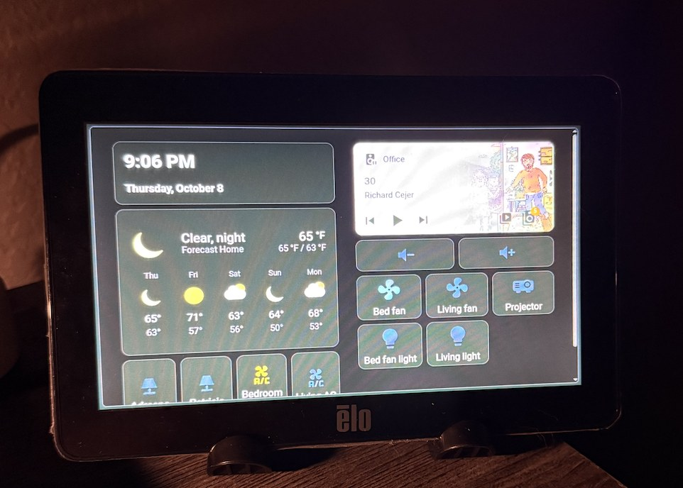
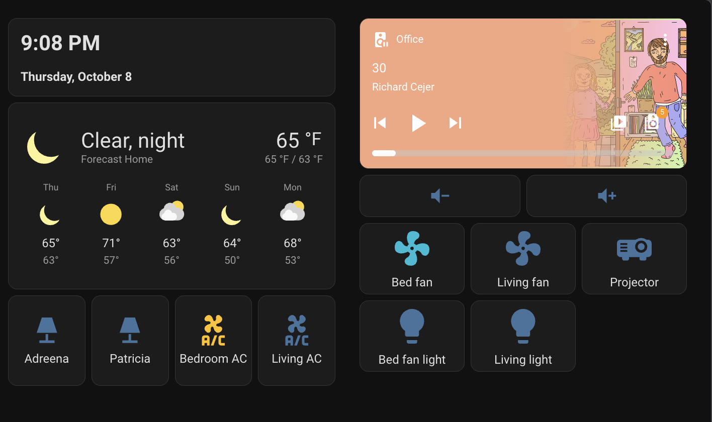
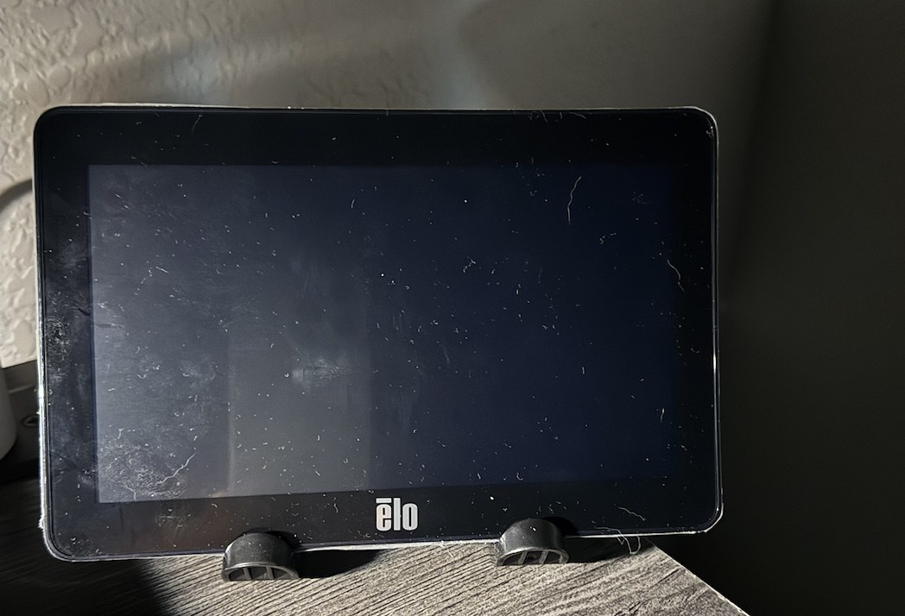
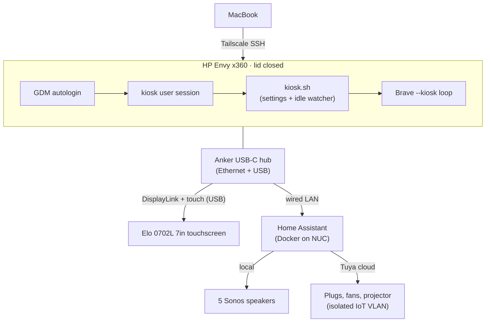

# Elo HA Panel — an old laptop turned smart-home control panel

> I turned a 2018 laptop nobody was using into a wall-style Home Assistant control panel on a 7" Elo touchscreen. Here's how it's built, and everything that broke along the way.



| Dashboard | Asleep (wakes on first tap) |
|---|---|
|  |  |

## What it does

- **One screen for the house:** clock, weather, now-playing on the Sonos, volume for every speaker at once, and one-tap buttons for lights, fans, ACs and a projector.
- **Sleeps and wakes like an appliance:** the screen goes dark after 30 seconds and wakes on the first tap (that tap doesn't press anything).
- **Can't get stuck:** if someone taps into a website, the kiosk quietly resets itself to the dashboard after a minute idle.
- **Survives power loss:** cold boot goes straight back to the dashboard with no login, no prompts, no clicks.
- **Managed remotely:** headless, lid closed, administered over Tailscale SSH.

## Architecture



## Hardware and software

- **Compute:** HP ENVY x360 15 (2018) — i7-8550U, 12 GB RAM — running lid closed.
- **Display:** Elo 0702L 7" (800×480) USB touchscreen — DisplayLink video via the kernel's built-in `udl` driver, touch via `hid-multitouch`. No proprietary drivers.
- **Connectivity:** Anker USB-C hub carrying Ethernet (ASIX AX88179) and the Elo's USB.
- **OS:** Zorin OS 18.1 (Ubuntu 24.04 base), GNOME on Wayland, kernel 7.0.
- **Browser:** Brave in `--kiosk` mode.
- **Backend:** Home Assistant Container on a separate NUC; Sonos integration (local) and Tuya integration (cloud).
- **Remote access:** Tailscale with Tailscale SSH.

## How it's built

- **Dedicated kiosk account:** a local, non-admin `kiosk` user with GDM autologin. My own account is untouched.
- **Kiosk script:** [`config/kiosk.sh`](config/kiosk.sh) applies GNOME settings at every login (no lock screen, no notifications, dark mode, 30 s blanking, never suspend, rotation lock), runs an idle watcher, and keeps Brave in a relaunch loop.
- **Power policy:** a logind drop-in ([`config/logind-kiosk.conf`](config/logind-kiosk.conf)) so closing the lid never suspends.
- **Home Assistant side:** a non-admin, local-network-only HA user for the kiosk, and a dedicated dashboard sized for 800×480 ([`ha/elo-panel-cards.yaml`](ha/elo-panel-cards.yaml)).
- **Volume control:** two HA scripts ([`ha/scripts.yaml`](ha/scripts.yaml)) that step every Sonos speaker up or down by 10%.

## What broke (and how I fixed it)

### 1. Link lights on, but Linux said "no cable"
- **Symptom:** the USB Ethernet adapter's lights were on, but NetworkManager reported `unavailable` and the kernel logged `Link status is: 0` eight times a second.
- **Investigation:** `lsusb` showed an ASIX **AX88179A**. Reading `bConfigurationValue` from sysfs revealed the chip exposes **three USB configurations**, and the kernel had picked config 2 (`cdc_ncm`). Switching to config 1 (`ax88179_178a`) still had no carrier. Config 3 (`cdc_ether`) linked immediately.
- **Fix:** a udev rule that forces config 3 on every plug-in ([`config/70-ax88179a-ecm.rules`](config/70-ax88179a-ecm.rules)). Verified on unplug/replug and cold boot.
- **Lesson:** "lights on" only proves the PHY negotiated. The driver binding is a separate layer worth checking directly.

### 2. Wired, but traffic still went over Wi-Fi
- **Symptom:** Ethernet was up, but `ip route get <HA IP>` showed traffic leaving via Wi-Fi.
- **Cause:** both interfaces were on the same subnet and Wi-Fi was winning on route metric. Separately, Tailscale's `accept-routes` was on, which made LAN traffic eligible to route through a subnet router.
- **Fix:** set the wired connection's route metric to 100 and `tailscale set --accept-routes=false`. Confirmed with `ip route get`.

### 3. The keyring prompt and the welcome tour
- **Symptom:** an autologin session with a Chromium-based browser pops a "unlock your keyring" dialog at every boot, and a brand-new user gets the GNOME setup wizard and the distro's welcome tour.
- **Fix:** `--password-store=basic` for Brave; a `gnome-initial-setup-done` marker; `Hidden=true` on the user-level copies of the distro's autostart entries (hiding rather than deleting, so the system-wide copies can't take over).

### 4. Tap-to-wake didn't work on the laptop screen
- **Symptom:** after blanking, keyboard and touchpad woke the screen but a tap on the glass did nothing.
- **Cause:** by design, GNOME's compositor disables the touchscreen mapped to a display when that display is powered off (to prevent ghost touches).
- **Outcome:** this is what pushed the move to the Elo. The Elo's touch is a separate USB device, so it stays live while its panel is dark — and the first tap only wakes the screen.

### 5. Lid closed, and the Elo went dark
- **Symptom:** with the Elo plugged into a running session, closing the lid turned *everything* off.
- **Investigation:** `journalctl` showed GNOME created a renderer for the new `udl` device but never added it as a monitor — it still listed only the laptop panel.
- **Fix:** reboot with the Elo already attached. At startup GNOME enumerates both GPUs together, and the Elo became the only display with the lid closed. No X11 fallback needed.

### 6. Hidden tabs piling up
- **Symptom:** tapping a scoreboard card opened a website in a new tab. In kiosk mode there's no tab bar, so tabs silently stacked up — and the browser restored them after a restart.
- **Fix:** wipe Brave's saved session before every launch (cookies kept, so the HA login survives), plus an idle watcher in `kiosk.sh` that asks GNOME's `IdleMonitor` over D-Bus for idle time and restarts Brave once after 60 s idle. The screen is already dark by then, so nobody sees it.

### 7. Volume buttons that did nothing
- **Symptom:** play, pause and skip worked from the panel; volume didn't.
- **Investigation:** used HA's **Events** tool to listen to `call_service` while tapping the panel. That proved the panel *was* sending `volume_up` (with the kiosk user's ID) — and running the same action from an admin session also did nothing, with no error. Meanwhile `volume_set` (what the slider uses) worked. Script **traces** confirmed the computed target volume.
- **Fix:** scripts that read each speaker's current `volume_level` and call `volume_set` with a templated value, looping over every media player in the "Sonos Speakers" area. The template check also caught that the **Spotify account entity** lived in that area, so it's explicitly excluded.

### 8. Controlling devices on an isolated IoT network
- **Constraint:** the smart plugs, fans and projector sit on an isolated IoT VLAN that can't reach the LAN — on purpose.
- **Decision:** rather than punch holes in that isolation, the devices were moved into the Smart Life app and brought into HA through the cloud Tuya integration. Trade-off accepted: these buttons depend on the internet.
- **Detail:** each plug exposes several switches; the dashboard targets the `_socket_1` outlet switch, not the child lock.

## Known limitations

- **No battery charge limit:** this laptop's BIOS doesn't offer one and sysfs doesn't expose it, so the battery sits at 100% on AC. Monitored for swelling.
- **Cloud dependency** for the IoT buttons (see #8).
- **Volume step is relative per speaker,** which preserves each room's balance but means speakers at different levels don't converge.

## Repo contents

```
elo-ha-panel/
├── README.md
├── config/
│   ├── kiosk.sh                   # kiosk session script (settings, idle watcher, Brave loop)
│   ├── ha-kiosk.desktop           # GNOME autostart entry for the kiosk user
│   ├── logind-kiosk.conf          # /etc/systemd/logind.conf.d/ — ignore lid switch
│   └── 70-ax88179a-ecm.rules      # /etc/udev/rules.d/ — AX88179A USB config fix
├── ha/
│   ├── scripts.yaml               # all-Sonos volume up/down scripts
│   └── elo-panel-cards.yaml       # dashboard button cards
└── images/                     # panel photos and dashboard screenshot
```

## Skills demonstrated

Linux endpoint provisioning and lockdown · GNOME/Wayland session configuration · udev and USB driver troubleshooting · NetworkManager routing · systemd-logind policy · Tailscale SSH remote management · Home Assistant dashboards, scripts and Jinja templating · evidence-driven debugging with event listeners and traces · network segmentation trade-offs
